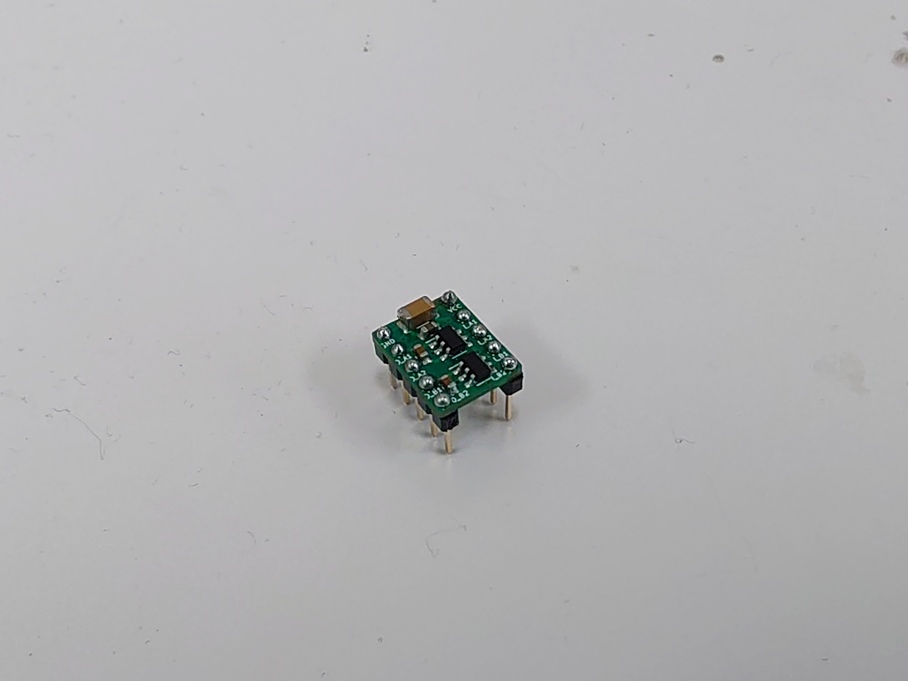

# Dual_AM8068_module

## What is this？
AMtekの激安HブリッジモータドライバAM8068を２つ利用した２つのDCモーター、または１つのステッピングモーターを駆動できるモジュール

### 特徴
- コンパクト
    - 横幅300milなのでブレッドボードやICソケットで利用可能
- パスコン実装済み
    - 電源ラインに0.1μF(100nF)と100μF、各出力ラインに0.1μF積層セラコンを配置済み
- 使いやすいピン配置
    - 電源ラインや入出力のピンをまとめて配置

### 仕様

|パラメータ|記号|Min|Max|単位|
|--|--|--|--|--|
|電源電圧|VCC|2|6.8|V|
|入力電圧|Vin|-0.3|VCC+0.3|V|
|出力電流|Imax|0|0.9|A|
|PWM入力周波数|Fin|0.02|65|kHz|

### ファイル
回路図、PCBファイルのPDFデータは[doc](/doc)に、KiCADファイルは[src](/src/)にあります

## License

このデバイスのライセンスは CERN-OHL-Sです\
ライセンスの詳細は [LICENSE](LICENSE) をご覧ください
